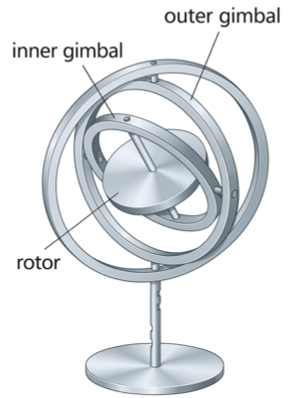

# Aircraft Position and Attitude

## Frames

A <strong>frame</strong> is defined as 

$$
{\rm F} =
\begin{bmatrix}
\overset{\rightharpoonup}{i} \cr
\overset{\rightharpoonup}{j} \cr
\overset{\rightharpoonup}{k}
\end{bmatrix},
$$

where $\overset{\rightharpoonup}{i}$, $\overset{\rightharpoonup}{j}$, and $\overset{\rightharpoonup}{k}$ are mutually orthogonal unit vectors.
A vector $\overset{\rightharpoonup}{r}$ can be written in terms of $$\rm F$$ as

$$
\overset{\rightharpoonup}{r} = r_x \overset{\rightharpoonup}{i} + r_y \overset{\rightharpoonup}{j} + r_z \overset{\rightharpoonup}{k} = \begin{bmatrix}
r_x & r_y & r_z
\end{bmatrix} \begin{bmatrix}
\overset{\rightharpoonup}{i} \\
\overset{\rightharpoonup}{j} \\
\overset{\rightharpoonup}{k}
\end{bmatrix} = \begin{bmatrix}
r_x & r_y & r_z
\end{bmatrix} {\rm F}
$$

<!--  -->

